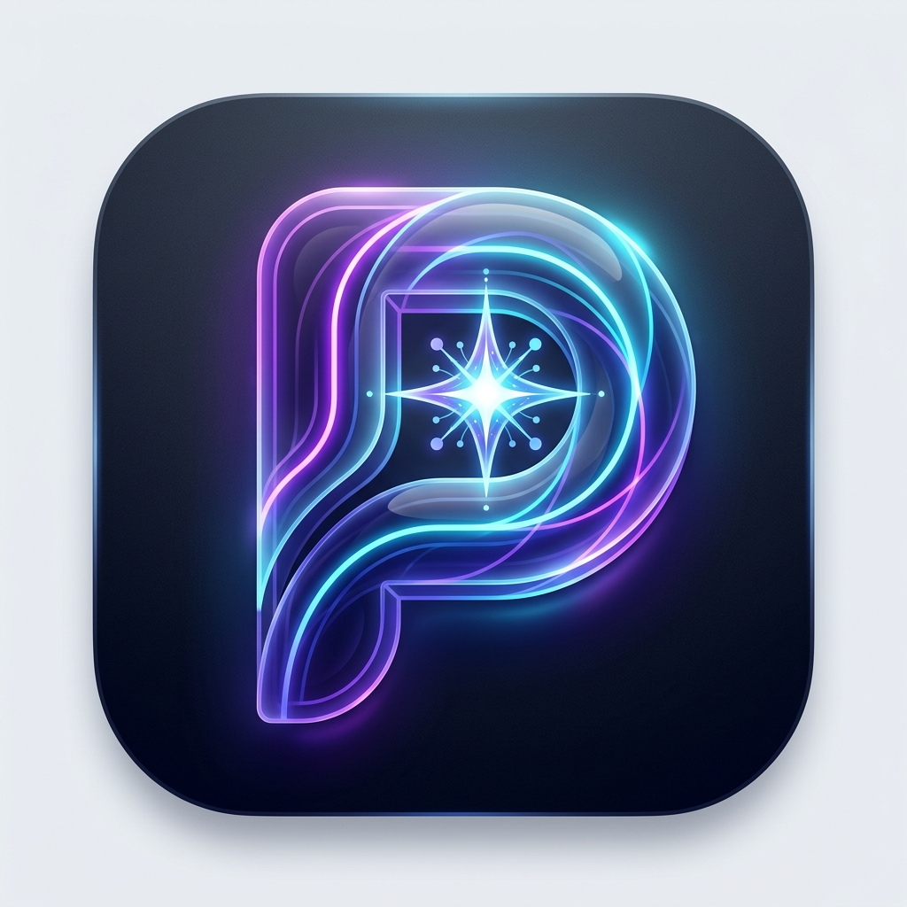

# PromptWise 🚀
### *Ask Better. Learn Better.*

<div align="center">
  

  <p align="center">
    <strong>An intelligent AI literacy and prompt engineering platform designed for students and creators.</strong><br />
    Stop getting mediocre answers from AI. Learn how to craft structured, high-impact prompts through interactive follow-ups and real-time diagnostic scoring.
  </p>

  <p align="center">
    <a href="#key-features">Key Features</a> •
    <a href="#how-it-works">How It Works</a> •
    <a href="#system-architecture">Architecture</a> •
    <a href="#tech-stack">Tech Stack</a> •
    <a href="#getting-started">Getting Started</a> •
    <a href="#deployment">Deployment</a>
  </p>

  <p align="center">
    
    
    
    
    
    
    
  </p>
</div>

---

## 📖 The Problem & Philosophy

Most students and learners use Generative AI tools (ChatGPT, Gemini, Claude, DeepSeek) like a search engine—entering vague, single-sentence prompts such as:
> *"Write an essay about climate change"* or *"Explain binary search"*.

This leads to generic, inaccurate, or superficial answers. Typical prompt "rewriters" simply slap generic buzzwords onto the prompt without knowing what the student actually needs.

### 💡 The PromptWise Approach
> **"Don't just improve the prompt. Understand what the user actually wants first."**

Instead of guessing your intent, **PromptWise acts as an AI Thinking Partner**:
1. It analyzes your initial prompt for ambiguities and missing context.
2. It asks **1–4 smart, targeted follow-up questions** (e.g., target audience, coding language, specific constraints, required output format).
3. It synthesizes your answers into a **masterfully engineered, production-ready prompt**.
4. It teaches you **why** each change was made and breaks down your prompt's quality using a 6-parameter diagnostic score.

---

## ⚡ Key Features

### 1. 🛠️ Socratic Prompt Improvement Engine (`/improve`)
- **Diagnostic Intent Extraction**: Detects the underlying domain, target persona, and missing constraints.
- **Adaptive Follow-Up Questionnaire**: Generates dynamic multiple-choice or short-answer questions tailored to your query.
- **Prompt Scorecard (0–100)**: Quantifies prompt quality across 5 dimensions:
  - 🎯 **Clarity**: Is the objective unambiguous?
  - 🔍 **Specificity**: Are details and context provided?
  - 📐 **Constraints**: Are boundaries and tone defined?
  - 📋 **Output Format**: Is the expected response structure outlined?
  - 🧠 **Context Richness**: Is background knowledge included?
- **Interactive Before & After Comparison**: Visual side-by-side preview with color-coded additions.
- **"Why This Works" Educational Breakdown**: Teaches the prompt engineering principles behind the rewrite.
- **1-Click Export**: Copy directly or launch into your preferred AI model.

### 2. 📚 Prompt Engineering Masterclass (`/learn`)
- **The 6 Core Building Blocks**:
  1. **Role / Persona**: Who should the AI act as?
  2. **Task & Objective**: What is the exact goal?
  3. **Context & Background**: Why is this needed and who is it for?
  4. **Step-by-Step Instructions**: How should the AI work through the problem?
  5. **Constraints & Guardrails**: What should the AI *avoid* doing?
  6. **Output Format & Style**: Tables, JSON, bullet points, or executive summary?
- **Interactive Anti-Pattern Guide**: Real examples of "vague prompts", "conflicting instructions", and "overloaded contexts" with their corrections.
- **Frameworks & Techniques**: Zero-shot, Few-shot, Chain-of-Thought (CoT), and Role-Prompting.

### 3. 💡 Curated Examples Library (`/examples`)
- **Real-World Student Scenarios**: Categorized examples for:
  - 💻 Software Development & Code Debugging
  - 📝 Academic Research & Thesis Writing
  - 🧮 Mathematics & Data Science
  - 🎓 Exam Revision & Active Recall
  - 💼 Resume & Career Preparation
- **Instant Testing**: Load any example directly into the improvement engine with one click.
- **Full Light & Dark Mode Compatibility**: Optimized readability across all lighting environments.

### 4. 🎯 Practice Arena (`/practice`)
- **Interactive Scenario Challenges**: Hands-on sandbox exercises with distinct student challenges.
- **Real-Time Rubric Scoring**: AI evaluates student drafts against prompt engineering benchmarks and provides immediate improvement tips.

### 5. 🧠 Skills & Knowledge Quiz (`/quiz`)
- **Adaptive AI Literacy Assessment**: Tests comprehension of prompting principles, token constraints, context windows, and safety rules.
- **Rank & Badge System**: Earn rankings from *Prompt Novice* to *Prompt Architect* based on performance.
- **Detailed Explanations**: Instant feedback on both correct and incorrect choices.

### 6. 🛡️ Responsible AI Hub (`/responsible-ai`)
- **Academic Integrity**: How to properly cite AI contributions and avoid plagiarism.
- **Privacy & PII Protection**: Guarding personal data, credentials, and sensitive info.
- **Hallucination Detection**: Triangulating sources and verifying critical AI outputs.
- **Bias & Fairness**: Recognizing model prejudices and stereotyping.

### 7. 👤 Student Dashboard & Cloud Persistence (`/dashboard`)
- **Secure Authentication**: Seamless Google OAuth & Guest Mode via Firebase Auth.
- **Cloud History**: Every improved prompt is automatically logged to Cloud Firestore.
- **Prompt Library & Bookmarks**: Favorite, organize, and re-export your best prompts at any time.

### 8. 🎨 UI/UX Excellence & Theming
- **Bespoke 3D Glassmorphic Branding**: Custom AI-generated brand mark and icons.
- **True Dual-Theme System**: Smooth transitions between crisp Slate Light Mode and deep Obsidian Dark Mode.
- **Mobile-First Bottom Navigation**: Native app experience with touch-optimized navigation on phones and tablets.

---

## 🏗️ System Architecture

```
┌─────────────────────────────────────────────────────────────┐
│                    PromptWise Client                        │
│          (React 19 + TypeScript + Tailwind CSS v4)           │
└───────────────┬─────────────────────────────┬───────────────┘
                │                             │
       Direct API Calls                User Auth & State
                │                             │
                ▼                             ▼
┌───────────────────────────────┐   ┌─────────────────────────┐
│     Cloudflare Worker API     │   │      Firebase SDK       │
│  (Edge Gateway / Reverse Prox)│   │  - Google OAuth Login   │
└───────────────┬───────────────┘   │  - Cloud Firestore      │
                │                   │    (Saved Prompts,      │
         Gemini API Key             │     History, Analytics) │
                ▼                   └─────────────────────────┘
┌───────────────────────────────┐
│       Google Gemini AI        │
│  (Gemini 2.5 Flash Engine)    │
│  - Prompt Diagnostics         │
│  - Dynamic Question Gen       │
│  - Prompt Synthesis & Scoring │
└───────────────────────────────┘
```

---

## 💻 Tech Stack

| Layer | Technology | Description |
|---|---|---|
| **Frontend Framework** | **React 19** | Latest React features with concurrent rendering |
| **Language** | **TypeScript 5** | Strict type-safety across all components and API calls |
| **Styling** | **Tailwind CSS v4** | Next-generation ultra-fast CSS engine with theme variables |
| **Build Tool** | **Vite 8** | Near-instant HMR and production bundle optimization |
| **Routing** | **React Router 7** | Client-side routing with nested layouts and active indicators |
| **Icons** | **Lucide React** | Clean, modern SVG icon set |
| **Backend / Edge** | **Cloudflare Workers** | Sub-millisecond serverless execution and CORS handling |
| **AI Intelligence** | **Google Gemini 2.5 Flash** | Ultra-fast multimodal reasoning engine |
| **Auth & Database** | **Firebase Auth + Firestore** | Realtime cloud persistence and Google authentication |

---

## 📁 Project Structure

```
PromptWise/
├── public/
│   ├── logo.png             # Official 3D Glassmorphic Brand Logo
│   ├── favicon.png          # App Favicon
│   └── ...                  # Static assets
├── src/
│   ├── assets/              # Icons and SVGs
│   ├── components/
│   │   ├── layout/          # Navbar, Footer, MobileNav, Layout wrapper
│   │   └── ui/              # BrandLogo, ThemeToggle, Cards, Modals, Buttons
│   ├── context/             # AuthContext, ThemeContext
│   ├── data/                # Quiz questions, example prompts, masterclass guides
│   ├── lib/
│   │   ├── api.ts           # Client API for Cloudflare Worker & Gemini
│   │   ├── db.ts            # Firestore operations (prompts, history, likes)
│   │   └── firebase.ts      # Firebase configuration & initialization
│   ├── pages/               # Home, Improve, Learn, Examples, Practice, Quiz, etc.
│   ├── App.tsx              # Application Routes and Providers
│   ├── index.css            # Tailwind CSS v4 styling & dark theme tokens
│   └── main.tsx             # React DOM root entry
├── worker/
│   ├── src/
│   │   └── index.ts         # Cloudflare Worker code calling Gemini AI
│   ├── package.json         # Worker dependencies
│   └── wrangler.jsonc       # Cloudflare Worker configuration & secrets
├── copy-logo.js             # Asset pipeline script for brand imagery
├── package.json             # Root npm dependencies and scripts
├── vite.config.ts           # Vite configuration
└── README.md                # Comprehensive documentation
```

---

## 🚀 Getting Started

### Prerequisites
- **Node.js**: v18.0.0 or higher
- **npm** or **pnpm**
- A **Google Gemini API Key** (from [Google AI Studio](https://aistudio.google.com/))
- A **Firebase Project** with Firestore and Authentication enabled

### 1. Clone & Install Dependencies
```bash
git clone https://github.com/your-username/PromptWise.git
cd PromptWise

# Install frontend dependencies
npm install

# Install worker dependencies
cd worker && npm install && cd ..
```

### 2. Configure Environment Variables

#### Frontend Configuration (`.env.local`)
Create a `.env.local` file in the root directory:
```env
# Cloudflare Worker API URL (local dev or deployed worker)
VITE_API_URL=http://localhost:8787

# Firebase Client Configuration
VITE_FIREBASE_API_KEY=your_firebase_api_key
VITE_FIREBASE_AUTH_DOMAIN=your_project.firebaseapp.com
VITE_FIREBASE_PROJECT_ID=your_project_id
VITE_FIREBASE_STORAGE_BUCKET=your_project.firebasestorage.app
VITE_FIREBASE_MESSAGING_SENDER_ID=your_sender_id
VITE_FIREBASE_APP_ID=your_app_id
```

#### Cloudflare Worker Configuration (`worker/wrangler.jsonc`)
In `worker/wrangler.jsonc` or via Cloudflare secrets:
```bash
npx wrangler secret put GEMINI_API_KEY
```

### 3. Sync Brand Assets
Run the logo asset copy script to ensure the image logo and favicon are correctly distributed to `public/`:
```bash
node copy-logo.js
```

### 4. Run Development Servers

In terminal 1 (Frontend):
```bash
npm run dev
```

In terminal 2 (Worker API):
```bash
cd worker
npx wrangler dev
```

Open your browser at `http://localhost:5173`.

---

## 🌐 Deployment

### 1. Deploy Cloudflare Worker (Backend)
```bash
cd worker
npm run deploy
```

### 2. Deploy Frontend (Cloudflare Pages / Vercel / Netlify)
Build the production bundle:
```bash
npm run build
```
Upload the `dist/` directory to Cloudflare Pages or link your repository to Vercel/Netlify.

---

## 🔒 Security & Academic Ethics

PromptWise is built with strict safety guidelines:
- **No Private Data Storage**: Prompts are not stored without explicit user consent.
- **Client-Side Firebase Rules**: Protected Firestore security rules ensuring students can only access their own saved data.
- **Safe AI Grounding**: Guardrail instructions prevent the model from answering malicious, infringing, or harmful prompting requests.

---

## 📄 License & Credits

Developed with ❤️ for students, researchers, and AI enthusiasts.
Released under the [MIT License](LICENSE).