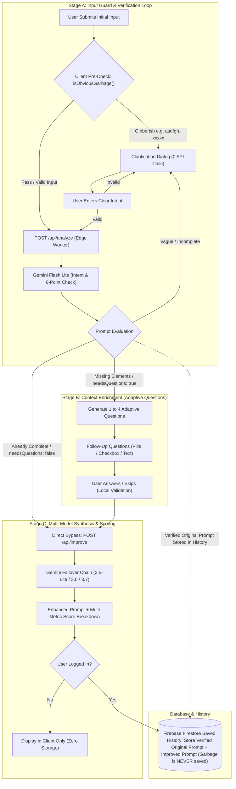

# PromptWise
### *Ask Better. Learn Better.*

<div align="center">
  

  <p align="center">
    <strong>An intelligent AI literacy and prompt engineering workbench designed for students and educators.</strong><br />
    Community Engagement Project (CEP) • Academic Session 2025–2026<br />
    <strong>Official Topic:</strong> <em>AI Literacy and Prompt Engineering Awareness for Students</em>
  </p>

  <p align="center">
    <a href="https://promptwise.naseem2917.workers.dev/"><strong>Live Application: promptwise.naseem2917.workers.dev</strong></a>
  </p>

  <p align="center">
    <a href="#-overview--academic-context">Academic Context</a> •
    <a href="#-key-features">Key Features</a> •
    <a href="#-session-memory-architecture">Session Memory</a> •
    <a href="#-system-architecture">Architecture</a> •
    <a href="#-ai-engine--failover-chain">AI Engine</a> •
    <a href="#-tech-stack">Tech Stack</a> •
    <a href="#-getting-started">Getting Started</a> •
    <a href="#-license--attribution">License</a>
  </p>

  <p align="center">
    
    
    
    
    
    
    
    
  </p>
</div>

---

## 🎓 Overview & Academic Context

**PromptWise** is developed as an academic **Community Engagement Project (CEP)** under the official topic:
> **"AI Literacy and Prompt Engineering Awareness for Students"**

Most students interact with generative AI (ChatGPT, Gemini, Claude) by typing superficial, single-sentence instructions such as:
> *"Write an essay about renewable energy"* or *"Explain binary trees"*.

This produces generic or hallucinated answers. PromptWise addresses this digital literacy gap not by merely re-writing prompts, but by serving as an **interactive reasoning workbench** that cultivates prompt engineering methodology, structural rigor, and responsible AI ethics.

---

## ⚡ Key Features

### 1. Socratic Prompt Improvement Engine (`/improve`)
- **Stage A (Local Validation & Verification Loop)**:
  - Instant client-side check (`isObviousGarbage`) identifying keyboard smashes, repeated characters, and unedited submissions with **0 API calls**.
  - Adaptive Clarification dialog preserving the student's text in place with auto-focus (`Ctrl+A` state) for zero-friction editing.
- **Stage B (Context Enrichment & Two-Way Follow-Up)**:
  - Dynamically extracts missing structural parameters through 0–4 targeted questions.
  - Option-based questions (`single_choice`, `multi_choice`, `toggle`) appear first, with open `text` questions last to optimize user momentum.
  - Full **`Back` navigation** with pre-filled selections and custom input memory.
  - Direct skip functionality allowing students to advance anytime.
- **Stage C (Multi-Model Synthesis & Diagnostic Scoring)**:
  - Generates production-ready prompts incorporating Persona, Context, Task, Constraints, and Formatting.
  - Deterministic 6-parameter diagnostic score (0–100) with 3-state breakdown: **Full (Specified)**, **Partial (Vague)**, **Missing (Absent)**.
  - Educational *"What Changed & Why"* rationale teaching prompt mechanics.
- **One-Click AI Chatbot Toolbar**:
  - Direct export links to **ChatGPT**, **Google Gemini**, and **Claude**.
  - Claude auto-prefill via `?q=` with background clipboard copy fallback.

### 2. Smart Session Memory & Cloud Sync
- **Active Session Draft Memory**:
  - **Improve Engine (`/improve`)**: Active prompt input, verification dialog state, and answered follow-ups are preserved across page switches.
  - **Skills Quiz (`/quiz`)**: Question index, selected answers, and running scores are maintained in session memory.
  - **Student Feedback (`/feedback`)**: Feedback ratings, category selection, and typed messages are automatically saved as a live session draft so no work is lost before submitting.
  - **Navigation State**: Selected category filters on `/examples` and active guide tabs on `/learn` are saved in session memory.
- **Authenticated Cloud Sync (Google OAuth + Cloud Firestore)**:
  - Synchronizes prompts, bookmarked favorites, and practice metrics permanently for signed-in students across devices.

### 3. Prompt Engineering Masterclass (`/learn`)
- Comprehensive guides on the **6 Core Building Blocks**: Role, Objective, Context, Steps, Constraints, Output Format.
- Interactive **Anti-Pattern Visualizer**: Real before/after breakdowns of vague prompts, conflicting instructions, and context overflow.
- **Responsible AI & Academic Ethics**:
  - Personal data scrubbing & PII protection.
  - Anti-hallucination guidelines and escape-hatch prompt phrasing.
  - Interactive 5-point Pre-Flight Ethics Checklist with session memory.

### 4. Curated Examples Library (`/examples`)
- Subject-organized templates spanning Computer Science, Mathematics, Academic Research, Technical Writing, and Career Preparation.
- Search and category filters saved across session navigation.
- 1-click loading directly into the `/improve` workbench.

### 5. Interactive Practice Quiz (`/quiz`)
- 6-question dynamic diagnostic quiz evaluating prompt engineering theory, token economics, and AI reasoning.
- Multi-model edge failover (`3.5-Lite` → `3.6-Flash` → `3.7-Flash`) with sanitized, user-friendly error handling.
- Automated smooth scroll alignment ensuring students are always positioned at the top of the next question.
- Session-persistent state ensuring navigation away from the page never loses active progress.
- Dedicated `Retake Set` and `New Question Set` controls with responsive mobile actions.

### 6. Student Dashboard & History Management (`/dashboard`, `/history`)
- Accessible to authenticated students with Google Sign-In.
- Real-time practice counters, latest quiz performance, and bookmarked prompt collections.
- Full keyword search and filter by bookmarked prompts.
- Inline prompt detail inspection, copy buttons, chatbot launchers, and deletion controls.

### 7. Student Feedback System (`/feedback`)
- In-depth feedback form capturing experience ratings, usability assessments, and open suggestions.
- Real-time session memory draft preservation, native validation tooltips, active character counter, and direct submission to Cloud Firestore.

### 8. Admin Feedback Center (`/admin`)
- Strictly feedback-focused panel displaying user ratings and prompt transformations.
- Batch selection and administrative clean-up tools.
- Strict privacy: No user emails or personal records are exposed.

---

## 💾 Session Memory Architecture

PromptWise incorporates a focused session persistence model across interactive student tools:

| Route | Storage Key | Persisted State |
|---|---|---|
| `/improve` | `promptwise_improve_state` | Draft prompt, active step, follow-up answers, clarification state, results |
| `/quiz` | `promptwise_quiz_session` | Questions, active question index, selected option, running score, completion status |
| `/feedback` | `promptwise_feedback_draft` | Live category selection, star rating, feedback message, and email draft |
| `/examples` | `pw_examples_cat` + `pw_examples_search` | Selected category filter and active search keywords |
| `/learn` | `pw_learn_tab` + `pw_learn_ethics` | Active guide tab and checked ethics checklist items |

---

## 🏗️ System Architecture

```
┌─────────────────────────────────────────────────────────────────────────┐
│                           PromptWise Client                             │
│       (React 19 + TypeScript + Tailwind CSS v4 + Framer Motion)         │
│          [ Progressive Web App with Service Worker & Caching ]          │
└───────────────────┬─────────────────────────────────┬───────────────────┘
                    │                                 │
            Edge API Requests                 User Auth & Storage
                    │                                 │
                    ▼                                 ▼
┌───────────────────────────────────────┐   ┌─────────────────────────────┐
│       Cloudflare Worker Gateway       │   │        Firebase SDK         │
│     (Single-Bundle Serverless Edge)   │   │  - Google OAuth Login       │
│                                       │   │  - Cloud Firestore          │
│  Endpoints:                           │   │    - Saved Prompts          │
│  - POST /api/analyze                  │   │    - Session Sync           │
│  - POST /api/improve                  │   │    - Student Feedback       │
│  - GET  /api/quiz                     │   └─────────────────────────────┘
└───────────────────┬───────────────────┘
                    │
            Resilient Fallbacks
         (Lite ⇄ Mid ⇄ High Chain)
                    │
                    ▼
┌───────────────────────────────────────┐
│           Google Gemini AI            │
│  - gemini-3.5-flash-lite  (Analyze)   │
│  - gemini-3.6-flash       (Medium)    │
│  - gemini-3.7-flash       (High/Deep) │
└───────────────────────────────────────┘
```

---

## 🔄 AI Request Flow



---

## 💻 Tech Stack

| Layer | Technology | Role |
|---|---|---|
| **Frontend Framework** | **React 19** | Modern concurrent UI architecture and hooks |
| **Type System** | **TypeScript 5** | End-to-end type safety across client and edge workers |
| **Styling & Design System** | **Tailwind CSS v4** | Structured Editorial Workbench tokens and theme classes |
| **Animations** | **Framer Motion** | Micro-interactions, layout transitions, button states |
| **PWA Infrastructure** | **vite-plugin-pwa & Workbox** | Service Worker, offline caching, installable manifest |
| **Edge Backend** | **Cloudflare Workers** | Sub-millisecond serverless execution at edge nodes |
| **AI Integration** | **Google Gemini AI** | `gemini-3.5-flash-lite`, `3.6-flash`, and `3.7-flash` failover chain |
| **Authentication & DB** | **Firebase Auth & Firestore** | Google OAuth authentication and cloud data persistence |

---

## 🚀 Getting Started

### Prerequisites
- **Node.js**: v18.0.0 or higher
- **npm** or **pnpm**
- **Google Gemini API Key** from [Google AI Studio](https://aistudio.google.com/)
- **Firebase Project** with Firestore and Google Authentication enabled

### 1. Clone & Install
```bash
git clone https://github.com/Naseem2917/PromptWise.git
cd PromptWise
npm install
```

### 2. Environment Configuration

#### Frontend (`.env.local`)
Create `.env.local` in the project root:
```env
VITE_FIREBASE_API_KEY=your_firebase_api_key
VITE_FIREBASE_AUTH_DOMAIN=your_project.firebaseapp.com
VITE_FIREBASE_PROJECT_ID=your_project_id
VITE_FIREBASE_STORAGE_BUCKET=your_project.firebasestorage.app
VITE_FIREBASE_MESSAGING_SENDER_ID=your_sender_id
VITE_FIREBASE_APP_ID=your_app_id
```

#### Cloudflare Edge Worker (`.dev.vars`)
Create `.dev.vars` in the root directory for local worker execution:
```env
GEMINI_API_KEY=your_google_gemini_api_key
```

### 3. Run Development Server
```bash
npm run dev
```
Open `http://localhost:5173` in your browser.

### 4. Build for Production
```bash
npm run build
```
This builds both the Cloudflare Worker serverless gateway (`dist/promptwise/`) and the client application (`dist/client/`).

---

## 🌐 Deployment

Deploy the application and serverless edge functions to Cloudflare:
```bash
# 1. Set secret in Cloudflare
npx wrangler secret put GEMINI_API_KEY

# 2. Deploy worker and client bundle
npm run deploy
```

Live Application URL: [https://promptwise.naseem2917.workers.dev/](https://promptwise.naseem2917.workers.dev/)

---

## 📄 License & Attribution

Designed and engineered by **Naseem Khan** for students, researchers, and educators.

This project is licensed under a **Non-Commercial with Mandatory Attribution License**:
- **Educational & Personal Use**: Permitted freely provided explicit attribution and repository references are maintained.
- **Commercial Use**: Prohibited without prior explicit written authorization.