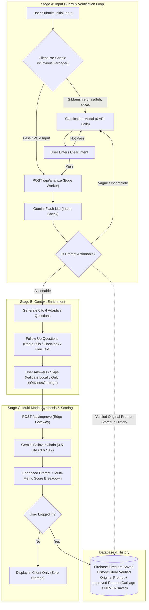

# PromptWise 🚀
### *Ask Better. Learn Better.*

<div align="center">
  

  <p align="center">
    <strong>An intelligent AI literacy and prompt engineering platform designed for students, researchers, and creators.</strong><br />
    Stop getting mediocre, surface-level answers from AI. Master how to craft structured, high-impact prompts through intelligent Socratic follow-ups, real-time diagnostic scoring, interactive practice arenas, and PWA capabilities.
  </p>

  <p align="center">
    <a href="https://promptwise.naseem2917.workers.dev/"><strong>🌐 Live Demo: promptwise.naseem2917.workers.dev</strong></a>
  </p>

  <p align="center">
    <a href="#-live-demo">Live Demo</a> •
    <a href="#-the-problem--philosophy">Philosophy</a> •
    <a href="#-key-features">Key Features</a> •
    <a href="#-system-architecture">Architecture</a> •
    <a href="#-ai-request-flow">AI Flow</a> •
    <a href="#-tech-stack">Tech Stack</a> •
    <a href="#-getting-started">Getting Started</a> •
    <a href="#-deployment">Deployment</a>
  </p>

  <p align="center">
    <a href="https://promptwise.naseem2917.workers.dev/"></a>
  </p>

  <p align="center">
    
    
    
    
    
    
    
    
  </p>
</div>

---

## 🌐 Live Demo

PromptWise is deployed live on Cloudflare's global edge network:
👉 **[https://promptwise.naseem2917.workers.dev/](https://promptwise.naseem2917.workers.dev/)**

- **Instant access**: No sign-in required to test prompt improvements or take quizzes.
- **Guest Mode & Google Sign-In**: Save prompts to cloud history and track your learning progress.
- **Install as App (PWA)**: Install directly on Android, iOS, Windows, or macOS for an offline-ready, full-screen desktop/mobile app experience.

---

## 📖 The Problem & Philosophy

Most students and learners use Generative AI tools (ChatGPT, Gemini, Claude, DeepSeek) like a search engine—entering vague, single-sentence prompts such as:
> *"Write an essay about climate change"* or *"Explain binary search"*.

This leads to generic, inaccurate, or superficial answers. Typical prompt "rewriters" simply slap generic buzzwords onto the prompt without knowing what the student actually needs.

### 💡 The PromptWise Approach
> **"Don't just rewrite the prompt. Understand what the user actually wants first."**

Instead of guessing your intent, **PromptWise acts as an AI Thinking Partner**:
1. **Stage A (Verification & Clarification)**: Analyzes your initial input. Detects gibberish/keyboard smashes locally with **0 API calls**. If vague, asks targeted clarification until clear.
2. **Stage B (Adaptive Follow-Ups)**: Asks **0–4 smart questions** (e.g., target audience, technical depth, formatting, specific boundaries) with clickable option pills or open text (with skip support).
3. **Stage C (Synthesis & Scoring)**: Synthesizes your answers into a **masterfully engineered, production-ready prompt**, evaluates quality (0–100) across 6 core parameters, and provides educational "What Changed & Why" explanations.

---

## ⚡ Key Features

### 1. 🛠️ Socratic Prompt Improvement Engine (`/improve`)
- **3-Stage Intelligent Architecture**:
  - **Smart Local Validation (Stage A)**: Instant client-side checks for single-word keywords (e.g. `"python"`, `"resume"`), keyboard smashes (`asdfgh`, `xxxxx`), repeated character spam, and unedited submissions with **0 Gemini calls** and zero token waste.
  - **Adaptive Clarification with Pre-Selected Input**: If prompt intent is unclear, guides the user with: *"What specific goal would you like to achieve?"* The user's input is kept in the text box and automatically highlighted (`Ctrl + A` state) so they can overwrite with a single keypress or use arrow keys to edit in-place.
  - **Two-Way Follow-Up Navigation (Stage B)**: Dynamic choice pills or open text to extract missing context. Features a **`← Back` Button** allowing users to return to previous questions with their selected options or custom answers preserved and pre-filled. Single-word answers (e.g. `"TYBSCIT"`, `"Python"`, `"Beginner"`) are cleanly accepted.
  - **Smart Follow-Up Sequencing (Options First, Text Last)**: Option-based questions (`single_choice`, `multi_choice`, `toggle`) are systematically ordered first, placing open-ended `text` questions at the very end to minimize typing fatigue and maximize user momentum.
  - **Final Synthesis (Stage C)**: Generates a high-impact prompt with role/persona, context, specific tasks, formatting, and constraints.
- **Persistent Model Preference**: Remembers the logged-in user's last selected Response Mode (Low ⚡ / Medium ⚖️ / High 🧠) across sessions and page reloads via user-scoped local persistence.
- **Direct Chatbot Quick Launch Toolbar**:
  - Direct 1-click launch buttons for **ChatGPT**, **Google Gemini**, and **Claude** using official SVG brand logos.
  - Available across **Improve Results**, **Dashboard**, and **Prompt History**.
  - **Claude Auto-Prefill + Clipboard Fallback**: Auto-prefills prompts into Claude via `?q=` with a background clipboard copy fallback for instant Ctrl+V pasting.
- **Accurate Scoring & Monotonic Improvement**:
  - Diagnostic scorecard (0–100) evaluating Goal, Context, Audience, Specificity, Format, and Constraints.
  - Guaranteed monotonic scoring: improved prompts never drop in score relative to the initial prompt.
- **Before & After Visualizer**: Side-by-side comparison with one-click copy and auto-saving.
- **"What Changed & Why" Breakdown**: Teaches students why each addition was made.

### 2. 📚 Prompt Engineering Masterclass (`/learn`)
- **The 6 Core Building Blocks**: Role, Objective, Context, Step-by-Step Instructions, Constraints, and Output Format.
- **Interactive Anti-Pattern Guide**: Real examples of "vague prompts", "conflicting instructions", and "overloaded contexts" with interactive before/after fixes.
- **Prompting Frameworks**: Zero-shot, Few-shot, Chain-of-Thought (CoT), and Role-Prompting explained simply.

### 3. 💡 Curated Examples Library (`/examples`)
- Categorized real-world prompt templates for Software Development, Academic Research, Math & Data Science, Exam Prep, and Career Planning.
- **1-Click Testing**: Load any example directly into the improvement engine with a single tap.

### 4. 🎯 Practice Arena (`/practice`)
- Hands-on sandbox exercises with realistic scenarios (e.g. debugging slow SQL queries, cold email rewrites, junior developer bug reports).
- Hint system and expert solutions to verify understanding.

### 5. 🧠 Skills & Knowledge Quiz (`/quiz`)
- 6-question interactive quiz testing prompt engineering principles, token economics, and LLM behavior.
- **`🔁 Retake Quiz` Feature**: Reset and re-attempt the exact same quiz questions to master weak spots.
- **`🔄 New Quiz` Feature**: Fetch fresh AI-generated questions from the server.
- Rank and proficiency scoring from *Prompt Explorer* to *Prompt Grandmaster*.

### 6. 📊 Dashboard & History Management (`/dashboard`, `/history`)
- **Complete Prompt History**: View, search, and filter previously improved prompts.
- **Direct AI Chatbot Launch**: Launch any saved prompt into ChatGPT, Gemini, or Claude directly from the dashboard card.
- **User Ownership & Prompt Deletion**: Permanently delete any prompt from your history with Firestore client & security rules ownership enforcement.

### 7. 🛡️ Responsible AI Hub (`/responsible-ai`)
- Academic integrity, plagiarism avoidance, citing AI contributions.
- Privacy protection (never sharing passwords, API keys, or personal identifiable information).
- Detecting hallucinations and verifying critical facts.

### 8. 📱 Progressive Web App (PWA) & Mobile Excellence
- Offline caching with Workbox Service Worker.
- Installable on mobile and desktop devices with dedicated high-res icons.
- Mobile-first bottom navigation bar, tight vertical spacing, and responsive branding.

### 9. 🔐 Admin Feedback Center (`/admin`)
- **Strict Privacy**: No personal user data or quiz history exposed; strictly feedback-focused.
- **Full Prompt Context**: Displays the exact **User Prompt** and **Improved Output Shown** alongside user comments.
- **Smart Rating Badges**: `👍 Helpful (Yes)` and `👎 Needs Improvement (No)` badges, 1-5 star ratings, and one-click copy buttons.
- **On-Demand Batch Selection**: Clean, uncluttered UI by default without pre-showing checkboxes. Clicking **"☑️ Select"** toggles selection mode where individual checkboxes, "Select All", and batch delete appear on-demand.

---

## 🏗️ System Architecture

```
┌─────────────────────────────────────────────────────────────────────────┐
│                           PromptWise Client                             │
│       (React 19 + TypeScript + Tailwind CSS v4 + Framer Motion)         │
│          [ Progressive Web App with Service Worker & Caching ]          │
└───────────────────┬─────────────────────────────────┬───────────────────┘
                    │                                 │
            Edge API Requests                 User Auth & Storage
                    │                                 │
                    ▼                                 ▼
┌───────────────────────────────────────┐   ┌─────────────────────────────┐
│       Cloudflare Worker Gateway       │   │        Firebase SDK         │
│     (Single-Bundle Serverless Edge)   │   │  - Google OAuth Login       │
│                                       │   │  - Cloud Firestore          │
│  Endpoints:                           │   │    - Saved Prompts          │
│  - POST /api/analyze                  │   │    - History Tracking       │
│  - POST /api/improve                  │   │    - User Feedback          │
│  - GET  /api/quiz                     │   └─────────────────────────────┘
└───────────────────┬───────────────────┘
                    │
           Resilient Fallbacks
        (Lite ⇄ Mid ⇄ High Chain)
                    │
                    ▼
┌───────────────────────────────────────┐
│           Google Gemini AI            │
│  - gemini-3.5-flash-lite  (Analyze)   │
│  - gemini-3.6-flash       (Medium)    │
│  - gemini-3.7-flash       (High/Deep) │
└───────────────────────────────────────┘
```

---

## 🔄 AI Request Flow

The diagram below illustrates the end-to-end lifecycle of a prompt request in PromptWise — featuring **lightweight local guards**, a **multi-model Gemini failover chain**, and **zero-token waste verification loops**:



### Flow Breakdown by Stage (Simple Explanation)

#### 🛡️ Stage A: Input Guard & Verification Loop (0-Token Waste)
1. **Client Pre-Check (`isObviousGarbage`)**: When you enter a prompt, PromptWise first runs a quick local check in your browser (no API calls, instant response).
   - If it detects keyboard smashes or gibberish (like `asdfgh` or `xxxxx`), it opens the **Clarification Modal** asking: *"What would you like me to help you create or figure out?"*
   - When you type your clear intent:
     - If it still doesn't pass, it loops back to check again.
     - If it passes (or if your initial prompt was already valid), it moves straight to the Cloudflare Edge Worker (`POST /api/analyze`).
2. **Actionability Check with Gemini Flash Lite**:
   - Gemini checks if the prompt is actionable and clear.
   - **Vague / Incomplete** (e.g., *"help me"* or *"fast"*): It asks for clarification and loops back so you can provide better details.
   - **Actionable**: It adopts this as the official **Verified Original Prompt**. Notice the dotted line in the diagram: this verified prompt is immediately tagged to be stored in history (any initial garbage is discarded forever).

#### 🎯 Stage B: Context Enrichment (Adaptive Questions)
1. **0 to 4 Smart Questions**: Gemini automatically creates 0–4 targeted follow-up questions to understand your target audience, goals, style, and constraints.
2. **Interactive Choices**: Rendered as easy clickable radio pills, checkboxes, or free text.
3. **Local Check & Skip**: Answers are checked locally on your device. You can freely skip questions without triggering unnecessary Gemini calls or false errors.

#### ✨ Stage C: Multi-Model Synthesis & Scoring
1. **Edge Gateway Improvement (`POST /api/improve`)**: Sends your verified original prompt together with your answers to the Cloudflare Edge Worker.
2. **Gemini Failover Chain**: Automatically chains `gemini-3.5-flash-lite` ⇄ `gemini-3.6-flash` ⇄ `gemini-3.7-flash` for high reliability and zero downtime.
3. **Final Result & Scoring**: Generates your enhanced prompt, side-by-side Before/After comparison, score improvements (Clarity, Specificity, Context, Constraints), and a *"What Changed & Why"* explanation.

#### 🔒 Database & History (Privacy by Design)
- **User Logged In (Yes)**: The prompt is saved to **Firebase Firestore**. It saves the **Verified Original Prompt** and the **Improved Prompt**. Unverified keyboard smashes or initial garbage are **NEVER saved**.
- **Guest / Not Logged In (No)**: Displayed only in your browser tab — zero persistent storage on the cloud for complete privacy.

---

## 💻 Tech Stack

| Layer | Technology | Description |
|---|---|---|
| **Frontend** | **React 19** | Latest React features, concurrent rendering, hooks |
| **Language** | **TypeScript 5** | Strict type-safety across client and edge workers |
| **Styling** | **Tailwind CSS v4** | Ultra-fast CSS engine with theme variables |
| **Animations** | **Framer Motion** | Smooth micro-animations and screen transitions |
| **PWA** | **vite-plugin-pwa & Workbox** | Offline caching, install manifest, service worker |
| **Build Tool** | **Vite 8** | Unified bundle pipeline for client and Cloudflare worker |
| **Edge Backend** | **Cloudflare Workers** | Sub-millisecond serverless execution at the edge |
| **AI Engine** | **Google Gemini Models** | `gemini-3.5-flash-lite`, `3.6-flash`, and `3.7-flash` |
| **Database & Auth** | **Firebase Firestore & Auth** | Google OAuth, persistent cloud history, feedback store |

---

## 📁 Project Structure

```
PromptWise/
├── public/
│   ├── Icon.png             # Official Transparent Brand Logo
│   ├── favicon.png          # App Favicon (64x64)
│   ├── pwa-192.png          # PWA Android/Desktop Icon (192x192)
│   └── pwa-512.png          # PWA Android/Desktop Icon (512x512)
├── src/
│   ├── components/
│   │   ├── improve/         # PromptInput, QuestionCard, BeforeAfter, ScoreDisplay, FeedbackWidget
│   │   ├── layout/          # Navbar, Footer, MobileNav, ScrollToTop
│   │   └── ui/              # Button, Spinner, ThemeToggle
│   ├── contexts/            # AuthContext, ThemeContext
│   ├── lib/
│   │   ├── api.ts           # Client API for Cloudflare Worker & Gemini
│   │   ├── auth.ts          # Google OAuth & Sign-in helpers
│   │   ├── db.ts            # Firestore operations (prompts, feedback, history)
│   │   ├── firebase.ts      # Firebase configuration & initialization
│   │   └── validation.ts    # Conservative local garbage check (0 API calls)
│   ├── pages/               # Home, Improve, Learn, Examples, Practice, Quiz, Admin, Dashboard
│   ├── types/               # TypeScript models & API interfaces
│   ├── App.tsx              # Application routing & layout tree
│   └── main.tsx             # React root mount point
├── worker/
│   └── index.ts             # Cloudflare Worker API (Analyze, Improve, Quiz)
├── .dev.vars                # Local development environment secrets (Gemini API Key)
├── wrangler.jsonc           # Cloudflare Worker deployment configuration
├── vite.config.ts           # Unified Vite + Cloudflare + PWA build configuration
└── package.json             # Root dependencies & build scripts
```

---

## 🚀 Getting Started

### Prerequisites
- **Node.js**: v18.0.0 or higher
- **npm** or **pnpm**
- A **Google Gemini API Key** from [Google AI Studio](https://aistudio.google.com/)
- A **Firebase Project** with Firestore and Google Authentication enabled

### 1. Clone & Install Dependencies
```bash
git clone https://github.com/Naseem2917/PromptWise.git
cd PromptWise

# Install all dependencies (root, worker, and PWA plugins)
npm install
```

### 2. Configure Environment Variables

#### Frontend Configuration (`.env.local`)
Create `.env.local` in the project root:
```env
# Firebase Configuration
VITE_FIREBASE_API_KEY=your_firebase_api_key
VITE_FIREBASE_AUTH_DOMAIN=your_project.firebaseapp.com
VITE_FIREBASE_PROJECT_ID=your_project_id
VITE_FIREBASE_STORAGE_BUCKET=your_project.firebasestorage.app
VITE_FIREBASE_MESSAGING_SENDER_ID=your_sender_id
VITE_FIREBASE_APP_ID=your_app_id
```

#### Cloudflare Worker Secrets (`.dev.vars`)
Create `.dev.vars` in the root directory for local worker development:
```env
GEMINI_API_KEY=your_google_gemini_api_key
```

### 3. Run Development Server
```bash
npm run dev
```
Open `http://localhost:5173` in your browser.

### 4. Build for Production
```bash
npm run build
```
This compiles:
1. `dist/promptwise/index.js` — Cloudflare Worker API bundle.
2. `dist/client/` — Client web application with PWA service worker and precached assets.

---

## 🌐 Deployment to Cloudflare

PromptWise runs entirely on **Cloudflare Workers & Pages**:

### Deploy with Wrangler:
```bash
# 1. Set production secret in Cloudflare
npx wrangler secret put GEMINI_API_KEY

# 2. Deploy worker and client assets
npx wrangler deploy
```

Your app will be live at:
`https://promptwise.<your-subdomain>.workers.dev/`

---

## 🔒 Security & Academic Ethics

- **Zero-Storage by Default**: Prompts are only saved if a logged-in user chooses to store them in their personal dashboard.
- **Client & Server Isolation**: API keys are securely held inside Cloudflare Worker environment secrets and never exposed to the client.
- **Privacy First**: The admin panel exposes strictly user feedback and prompt context for model improvement, completely hiding personal user profiles and quiz metrics.

---

## 📄 License & Credits

Developed with ❤️ by **Naseem Khan** for students, educators, and creators worldwide.

This project is licensed under a **Non-Commercial with Mandatory Attribution License** — see the [LICENSE](LICENSE) file for complete terms:

- ✅ **Personal & Educational Use**: Permitted freely provided explicit credit and repository links are preserved.
- ❌ **Commercial Use & Selling**: Strictly prohibited. You cannot sell, redistribute for money, or use this project for any paid product/service without prior explicit written permission from Naseem Khan.